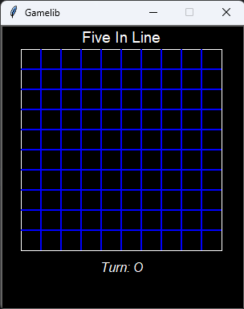
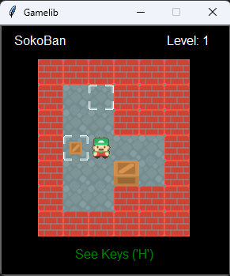

# Algorithms-and-programming-1

This repository contains the works carried out in the subject "Algorithms and Programming 1" at the Faculty of Engineering (UBA).

## Five in line:

An introductory exercise designed to teach students how to use the Gamelib library provided by the
course instructor. This library would be used in subsequent assignment.

  
   
  <em>Five in line game</em>

## Sokoban Game:

The second assessment required the student to establish the logic of the Sokoban game,
which would be used in subsequent evaluations. Also, enhancing the previous logic and graphical interface of Sokoban.
Additional functionalities were added, such as the ability to use hints and undo/redo movements, providing players
with more options to successfully complete levels.

  
   
  <em>Sokoban game</em>